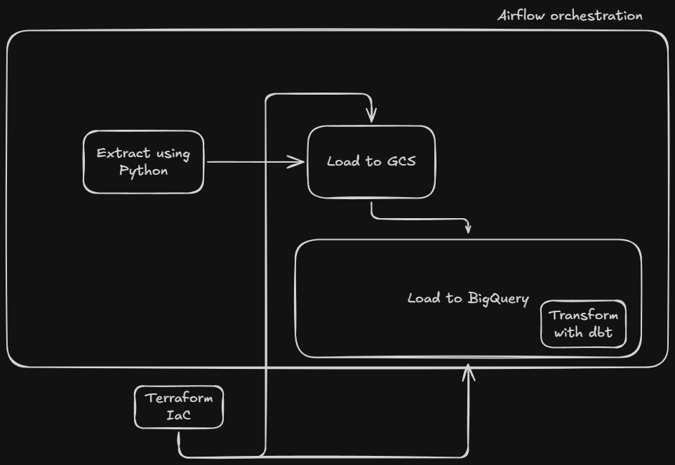
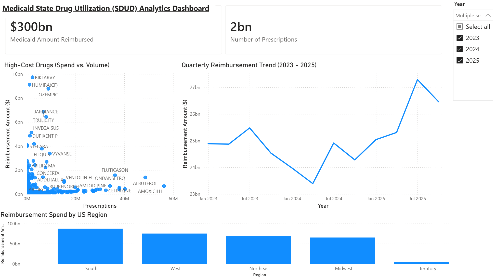
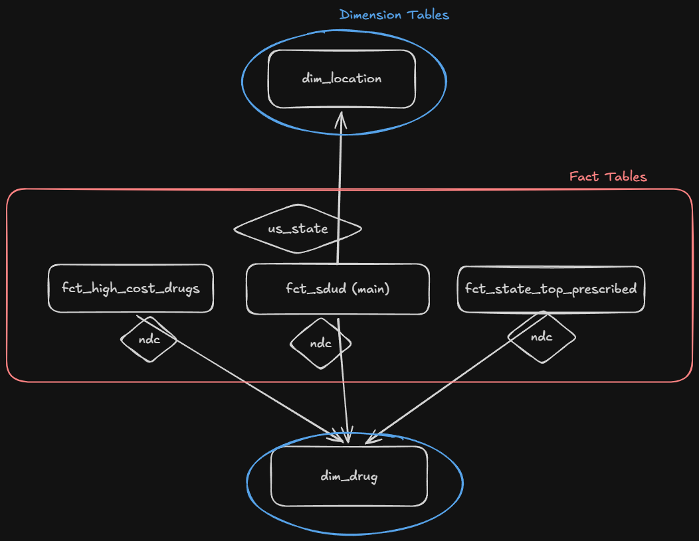

# 🏥 State Drug Utilization (SDUD) Data Pipeline & Analytics

An end-to-end, cloud-native **ELT Data Pipeline** and **Analytics Dashboard** analyzing State Drug Utilization Data from [data.medicaid.gov](https://data.medicaid.gov/). 

This project processes **$300B+ in Medicaid drug reimbursements** across 2 Billion+ prescriptions (2023–2025), isolating high-cost specialty drug outliers, quarterly spend trajectories, and regional utilization patterns.

---

## 📐 Architecture



### Technology Stack
* **Containerization:** Docker & Docker Compose
* **Infrastructure as Code (IaC):** Terraform
* **Storage & Data Warehouse:** Google Cloud Storage (GCS) & Google BigQuery
* **Orchestration:** Apache Airflow (Astronomer Astro CLI)
* **Transformation & Modeling:** dbt-core (Astronomer Cosmos)
* **Visualization & Analytics:** Power BI Desktop

---

## 📊 Analytics Dashboard & Insights



### Key Analytical Findings:
* **$300.4B Total Spend Analyzed:** Processed multi-year Medicaid utilization records across all 50 states and territories.
* **Specialty Drug Outliers:** Identified high-cost specialty pharmaceuticals (e.g., *Biktarvy*, *Humira*, *Ozempic*) that represent less than 1% of total prescription volume but drive over 15% of total reimbursement dollars.
* **Quarterly Volatility:** Detected a spending dip in Q2 2024 ($23.4B) followed by a sharp surge reaching a peak of **$27.3B in Q3 2025**.
* **Regional Disparities:** The **South region** leads the nation in total Medicaid drug reimbursement (~$100B), followed by the West region.

---

## 🛠️ Data Modeling & Transformations (dbt)

Raw Medicaid data is transformed into a **Galaxy Schema (Fact Constellation)** featuring multiple fact tables sharing conformed dimensions:



---

## 🚀 Quickstart & How to Run

### Prerequisites
* [Docker Desktop](https://www.docker.com/products/docker-desktop/)
* [Astro CLI](https://docs.astronomer.io/astro/cli/install-cli)
* [Terraform CLI](https://developer.hashicorp.com/terraform/downloads)
* Google Cloud Platform (GCP) account with Billing enabled

### 1. Clone & Authenticate
```bash
git clone https://github.com/jaesone-ui/medicaid-data-pipeline.git
cd medicaid-data-pipeline

# Authenticate with your Google Cloud account
gcloud auth application-default login
```

### 2. Configuration
Copy `.env.example` to `.env` and place your GCP service account key at `include/gcp-key.json`:
```bash
cp .env.example .env
```

### 3. Run Pipeline with Makefile
The project includes a `Makefile` for simple setup and tear-down:

```bash
# 1. Provision GCS Bucket & BigQuery Dataset via Terraform, then start Airflow
make up

# 2. Alternatively, run steps individually:
make infrastructure   # Provision GCP resources
make start            # Start Airflow containers (http://localhost:8080)
make stop             # Stop Airflow containers
make destroy          # Tear down GCP resources
```

---

## 📜 License
This project is licensed under the MIT License - see the [LICENSE](LICENSE) file for details.